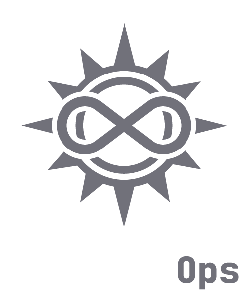

<picture>
    <source
        srcset="docs/images/logo_dark.png"
        media="(prefers-color-scheme: light), (prefers-color-scheme: no-preference)"
    />
    <source
        srcset="docs/images/logo_light.png"
        media="(prefers-color-scheme: dark)"
    />
    
</picture>

# SolsticeOps-core

SolsticeOps is a modular DevOps management dashboard.

[Русская версия](README-ru_RU.md)

## Screenshots

[Dashboard](docs/images/dashboard/)
[Docker](docs/images/docker/)
[K8s](docs/images/k8s/)
[Jenkins](docs/images/jenkins/)
[Ollama](docs/images/ollama/)

## Architecture
This is the core component which provides:
- User authentication
- Module registration and loading
- Server statistics and dashboard
- Generic tool management
- Terminal session management

## Documentation
Detailed documentation is available in the `docs/en_US/` directory.
- [Installation](docs/en_US/installation.md)
- [Creating Modules](docs/en_US/module_creation.md)
- [API Reference](docs/en_US/api_reference.md)

## Dependency Management
SolsticeOps uses a modular dependency approach. 
- Core dependencies are listed in the root `requirements.txt`.
- Each module maintains its own `requirements.txt` for specific functionality.
This ensures you only install what you actually use.

## Modules
SolsticeOps uses Git submodules for its modules. Available modules:
- [Docker](https://github.com/SolsticeOps/SolsticeOps-docker)
- [Kubernetes](https://github.com/SolsticeOps/SolsticeOps-k8s)
- [Jenkins](https://github.com/SolsticeOps/SolsticeOps-jenkins)
- [Ollama](https://github.com/SolsticeOps/SolsticeOps-ollama)
